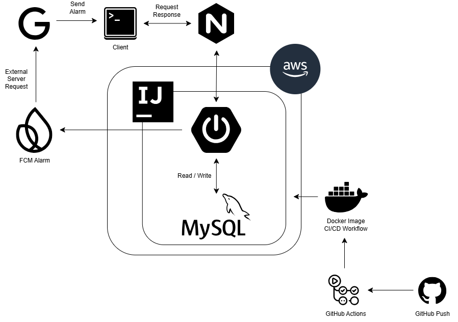
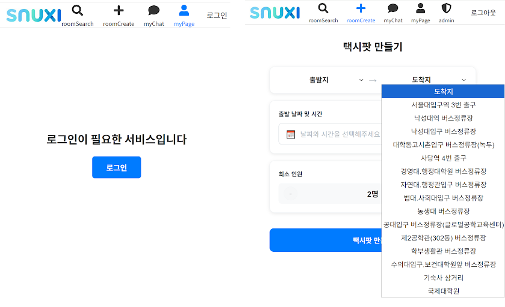
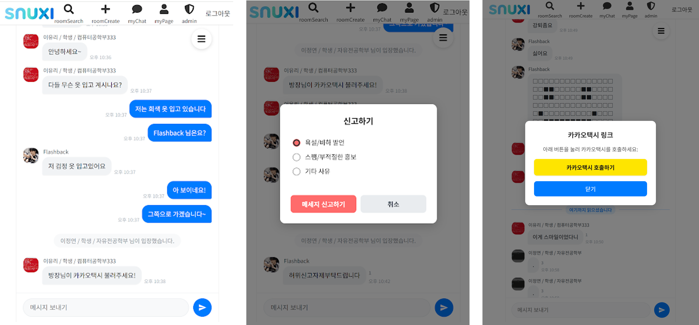

# SNUXI - 서울대 학내 택시팟 모집 서비스  
서울대 인근 지역에서 택시를 함께 탑승할 학우들을 모집해보세요!  
  
**[🔗 배포 링크](https://snuxi.com)**  
  
**[GitHub Link]**  
  
Server : https://github.com/wafflestudio/23-5-team3-server  
Client : https://github.com/wafflestudio/23-5-team3-web  
  
## 목차  
- **프로젝트 개요**  
- **기술 스택 및 협업 전략**  
- **아키텍처 구조**  
- **주요 기능**  
- **트러블 슈팅 및 기술적 의사결정**  
- **업데이트 내역**  

## 1. 프로젝트 개요  
### 🚘 SNUXI 서비스  
택시를 함께 탈 서울대학교 학우들을 모집하는 서비스입니다.  
학교 메일 인증으로 인증된 구성원들과 함께 안전하고 경제적으로 등하교길을 이용하세요!

### 🗓️ 기간  
2025.12 ~ 2026.02  
  
### 👩🏻‍💻 개발자
 

| [김기환(BE)](https://github.com/LOV-ING-U) | [김용현(BE)](https://github.com/Mined2022) | [나규하(FE)](https://github.com/Daniel-Na118) | [이유리(BE)](https://github.com/colswap) | [이정연(FE)](https://github.com/jylee05) |
| :---: | :---: | :---: | :---: | :---: |
|  |  |  |  |  |
| WebSocket 기반 메시징 시스템 및 팟 참여/퇴장 트랜잭션 구현 | 세션 기반 OAuth 로그인 및 신고 기능 구현 | (프론트엔드) | 배포 인프라 구축 및 FCM 기반 알림 구현 | (프론트엔드) |

 
  
## 2-1. 🧱 Tech Stack  
#### Front-End  

    
    
    
    

  

#### Back-End  

    
    
    
    
    
    
    

  

## 2-2. 협업 전략  
- **Slack, Notion, Swagger 기반 API 명세 공유 및 아키텍처 구조 협의**  
**[🔗 API 명세서](https://www.notion.so/API-2ffe04be1b438100888be0685a7158ba?source=copy_link)**  
  
- **주 단위 스프린트, 커밋 컨벤션 규칙 및 Git, GitHub를 통한 PR 단위 코드 리뷰**  
**[🔗 Swagger UI](https://api.snuxi.com/swagger-ui/index.html)**  
  
| 커밋 컨벤션 | 작업 |  
| --------- | ---- |  
| feat(ure) | 기존 코드, 새로운 기능 추가 |  
| fix, refactor | 기존 코드 수정 |  
| hotfix | 긴급 수정 |  
| add | 새로운 코드 추가 |  
  

## 3. 아키텍처 구조(BE)   
  
    
## 4. 주요 기능  
#### 학교 메일 인증 시스템 및 랜드마크 기반 택시팟 생성  
OAuth2 소셜 로그인으로 안전하게, 그리고 학우들이 자주 사용하는 대표 지역으로 구성  

  
#### 실시간 텍스트 채팅방 및 신고 기능, 간편한 카카오택시 딥링크 기능 지원  
WebSocket 기술 기반 실시간 채팅, 카카오택시로의 간편한 리다이렉트  

  
## 5. 트러블 슈팅 및 기술적 의사결정  
#### 1. Kubernetes 대신 Nginx를 사용한 이유  
엄격한 인증이 필요한 서비스 특성 상, 서비스 규모가 작아 k8s가 지원하는 자동 확장/자동 복구 등의 기능보다는, Nginx를 통한 단순 프록시 기능만을 사용하여 관리 측면에서 유리합니다.  
k8s를 사용하더라도 단일 pod로 충분할 것이라는 판단 하에, 설정이 간단한 Nginx를 사용하였습니다.  
  
#### 2. WebSocket 에서의 메시지 전송 동적 제어 및 인증 흐름  
단일 Pod 환경에서 메시지 전송을 동적으로 제어하기 위해 @SendTo, 외부 메시지 브로커를 사용하지 않고 simpMessagingTemplate 및 pub시 기본 메시지 브로커를 사용하였습니다.  
인증 흐름은 WebSocket Upgrade를 위한 Handshake, 메시지 요청 종류에 따른 적합성을 검토하는 Interceptor, 메시지를 전송하는 비즈니스 로직으로 제어 흐름을 분리하였습니다.  
  
#### 3. 소셜 로그인 시 세션 방식을 선택한 이유  
HttpOnly 쿠키로 XSS 공격을 차단하고, 악성 유저 발생 시 서버에서 즉시 세션을 만료 시켜 강제 로그아웃 할 수 있는 제어권을 확보했습니다.

로그인 시 DB의 userId를 세션에 함께 담도록 커스터마이징하여(CustomOAuth2User), API 요청마다 DB 조회 없이 유저를 식별할 수 있게 성능을 최적화했습니다.

이용자 예상 규모(최대 수백 명)에 맞춰 JWT보다 세션 방식이 구현 비용 대비 효율적이라고 판단했습니다.  
  
#### 4. 페이지네이션 및 DB 인덱스 전략  
커서 기반 페이지네이션과 오프셋 기반 페이지네이션 중에서, 무한 스크롤 및 데이터의 지속적인 삽입/삭제가 요구되는 환경에서 사용자의 서비스 이용 신뢰를 보장하기 위해 커서 기반 페이지네이션을 사용하였습니다.  
  
또한, chat_message의 DB table에 (pot_id, id) 기반 복합 인덱스를 통해 커서 기반 페이지네이션의 함수 실행속도를 최적화 하였고, mysql 콘솔에서 filesort -> backward index scan을 확인하였습니다.  
  
#### 5. 채팅방에서 나가지 않고 탈퇴한 유저의 처리 및 해당 유저의 채팅 보존 처리  
채팅방에서 나가지 않고, 회원 탈퇴를 한 유저의 경우와, 해당 유저의 채팅 내역을 페이지네이션으로 가져오기 위해 회원 탈퇴시 User table에서 id(PK) = 0으로 설정하여 채팅 내역을 보존하고, chat_message DB table의 ON DELETE CASCADE를 우회합니다.  
  
## 6. 업데이트 내역  
- ~ 2026.02.07 : 프로젝트 1차 개발 완료, Waffle Studio 동아리 부원 대상 시연 및 버그 바운티  
- ~ 2026.02.18 : 버그 바운티 완료, 코드 리팩토링  
- After : k6 스크립트 이용 서버 성능테스트(예정)