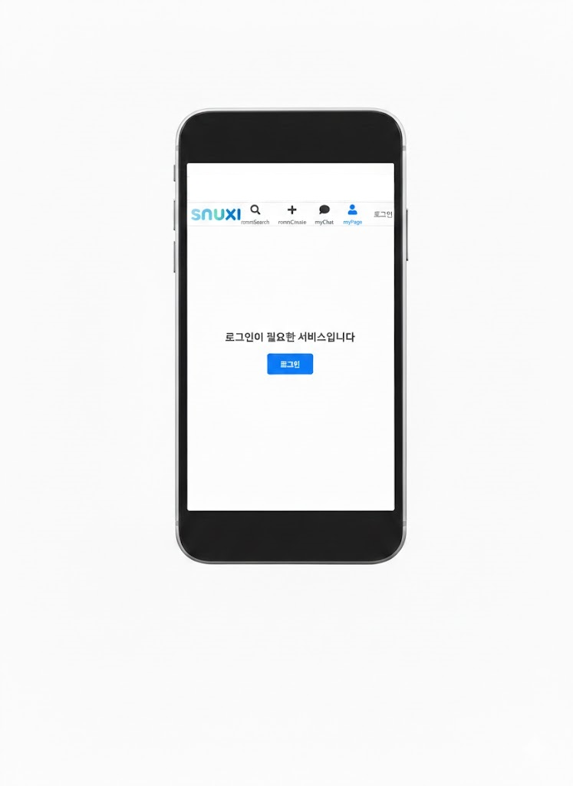
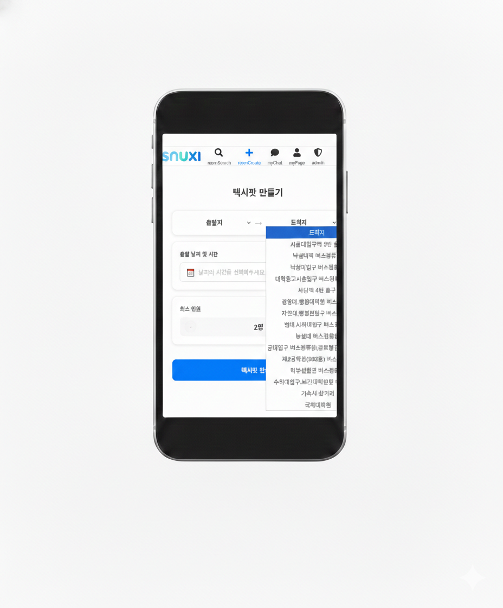
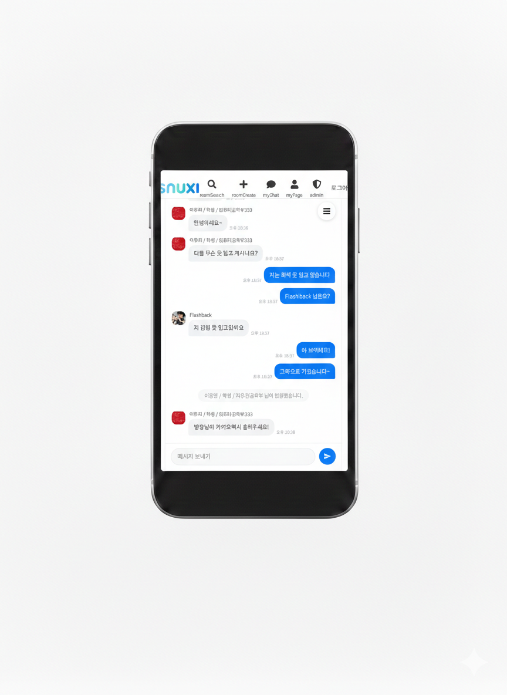
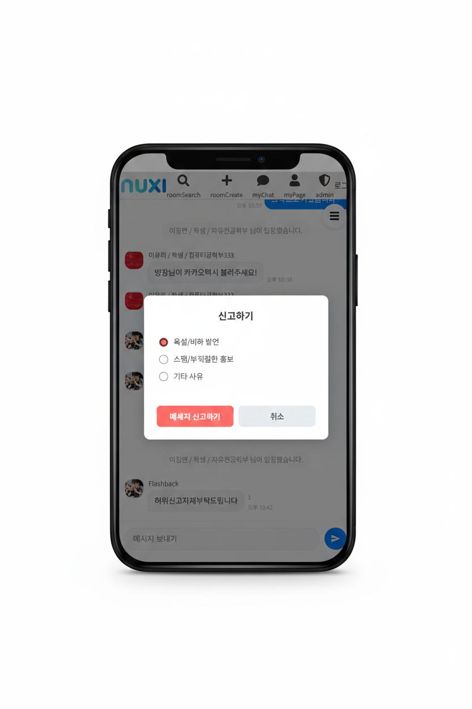

# SNUXI - 서울대 학내 택시팟 모집 서비스  
서울대 인근 지역에서 택시를 함께 탑승할 학우들을 모집해보세요!  
  
**[🔗 배포 링크](https://www.snuxi.com)**  
  
**[GitHub Link]**  
  
Server : https://github.com/wafflestudio/23-5-team3-server  
Client : https://github.com/wafflestudio/23-5-team3-web  
  
## 목차  
- **프로젝트 개요**  
- **아키텍처 구조**  
- **주요 기능**  
- **기술적 의사결정**  

## 프로젝트 개요  
### 🚘 SNUXI 서비스  
택시를 함께 탈 서울대학교 학우들을 모집하는 서비스입니다.  
학교 메일 인증으로 인증된 구성원들과 함께 안전하고 경제적으로 등하교길을 이용하세요!

### 🗓️ 기간  
2025.12 ~ 2026.02  
  
### 👩🏻‍💻 개발자
 

| [김기환(BE)](https://github.com/LOV-ING-U) | [김용현(BE)](https://github.com/Mined2022) | [나규하(FE)](https://github.com/Daniel-Na118) | [이유리(BE)](https://github.com/colswap) | [이정연(FE)](https://github.com/jylee05) |
| :---: | :---: | :---: | :---: | :---: |
|  |  |  |  |  |

 
  
### 🧱 Tech Stack  
#### Front-End  

    
    
    
    

  

#### Back-End  

    
    
    
    
    
    
    

  

### 협업 전략  
#### Slack, Notion, Swagger 기반 API 명세 공유 및 아키텍처 구조 협의  
https://www.notion.so/API-2ffe04be1b438100888be0685a7158ba?source=copy_link  
  
#### 주 단위 스프린트 및 Git, GitHub를 통한 PR 단위 코드 리뷰  
https://api.snuxi.com/swagger-ui/index.html  
  
## 아키텍처 구조(BE)   
  
    
## 주요 기능  
#### 1. 약관 동의와 학교 메일 인증 절차로 안전하게!  
OAuth2 기반 학교 메일 로그인을 통해 인증된 구성원들끼리 택시팟을 이용할 수 있어요.

   
#### 2. 택시팟 생성은 랜드마크 기반 출발, 도착지 지정으로 간편하게!  
학교 안, 서울대입구역, 낙성대역, 녹두까지! 학우들이 자주 사용하는 대표 지역으로 빠르게 이용해보세요.  

  
#### 3. 실시간 채팅으로 보다 빠르게!  
WebSocket 기술을 기반으로 빠른 실시간 텍스트 채팅을 지원해요.  

  
#### 4. 부적절한 채팅은 No! 신고 기능으로 채팅방을 클린하게!  
운영자가 채팅 내역을 모두 볼 수 있어요! 목적에 맞는 서비스 이용을 부탁드려요.  

  
## 기술적 의사결정  
#### 1. Kubernetes 대신 Nginx를 사용한 이유  

#### 2. WebSocket 에서의 메시지 전송 동적 제어 및 인증 흐름  

#### 3. 소셜 로그인 시 세션 방식을 선택한 이유  
